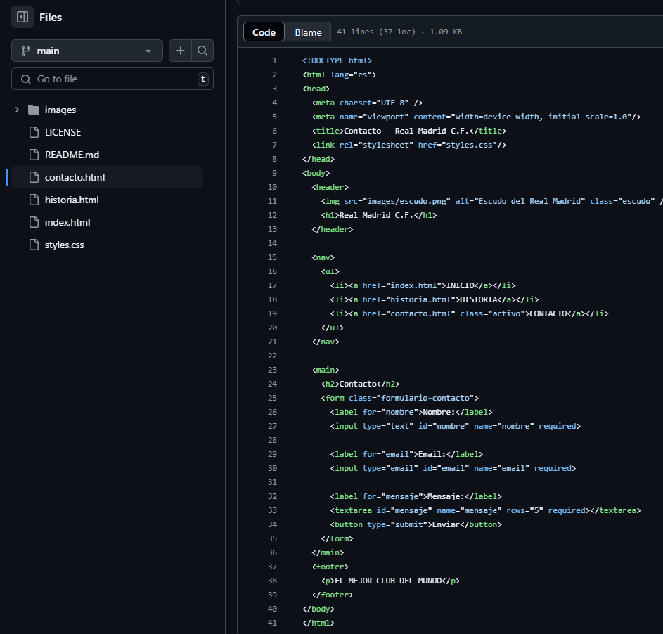

# Practica-final

**1. Descripció del projecte i tema escollit:**
Aquest projecte consisteix en la creació d’un lloc web personal senzill, compost per diverses pàgines HTML: index.html, historia.html i contacto.html. El tema escollit gira al voltant d’una presentació personal o fictícia, incloent una petita història i un formulari de contacte.

**2.Explicació del layout i estructura:**
El lloc web està format per tres pàgines principals:

*index.html: pàgina principal amb informació introductòria.*

*historia.html: secció on es desenvolupa una petita història o biografia.*

*contacto.html: pàgina amb un formulari de contacte.*

Totes les pàgines comparteixen una mateixa estructura bàsica amb etiquetes de HTML. Té un menú de navegació que facilita el pas entre pàgines. El layout es basa en una distribució en columna per a dispositius mòbils i una disposició en dues columnes per a pantalles més grans.

**Detalls sobre l’estil CSS i els efectes visuals:**
L’estil del lloc es defineix mitjançant el fitxer styles.css. Inclou:

Colors suaus i agradables per afavorir la llegibilitat (predomini de tons blaus i grisos).

Tipografia sans-serif moderna i neta.

Disseny responsive, adaptat tant a mòbils com a ordinadors.

Efectes visuals com canvis de color al passar el cursor sobre els enllaços.

Organització del contingut mitjançant Flexbox per a una distribució flexible i eficient.

**Decisions de disseny i raonaments:**

S’han utilitzat etiquetes semàntiques per millorar l’accessibilitat i la claredat del codi.

El menú de navegació és visible i constant en totes les pàgines per facilitar la navegació.

L’estil CSS està separat del contingut HTML per seguir les bones pràctiques.

S’ha tingut en compte la compatibilitat amb diferents dispositius mitjançant disseny responsive.

El formulari de contacte utilitza validació bàsica amb HTML5.

**Captures de pantalla del resultat final:**

Pàgina d’inici (index.html)

Pàgina de la història (historia.html)

Formulari de contacte (contacto.html)

